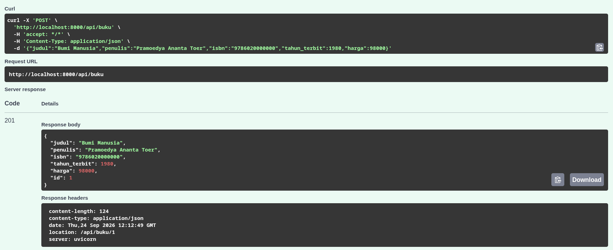
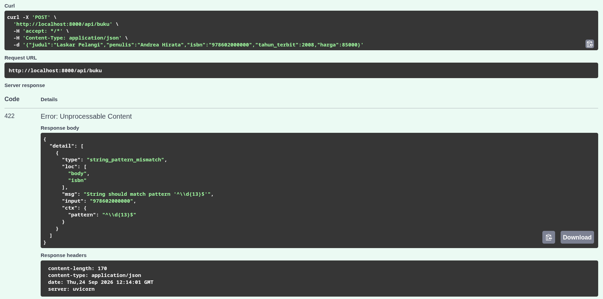
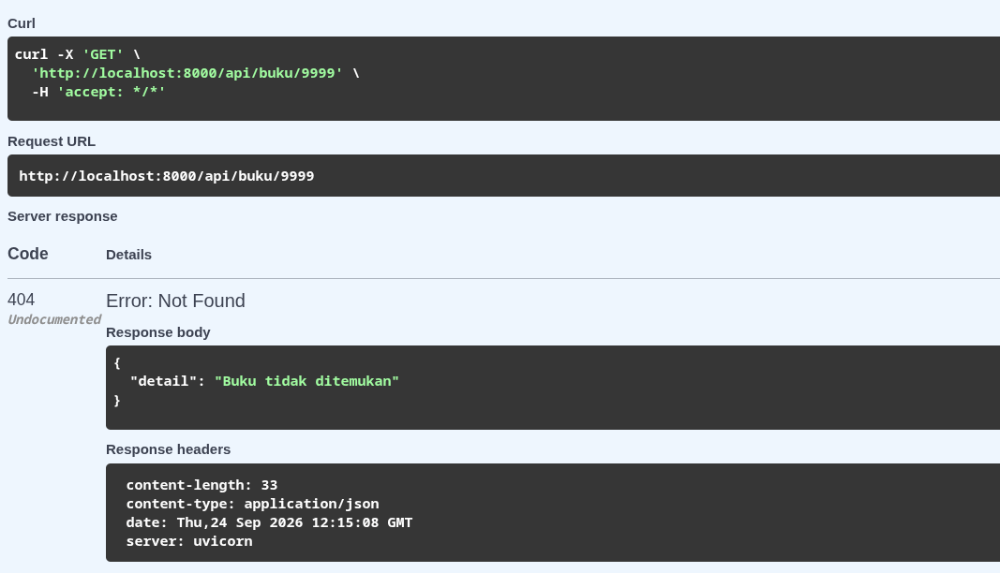

# Tugas Individu — Endpoint Buku (FastAPI)

NIM: 24120510002

Endpoint sederhana untuk entitas **Buku**. Data disimpan di memori (belum pakai database).

## Prasyarat

- Python 3.11+
- Git

## Cara menjalankan

```bash
cd backend
python -m venv venv
source venv/bin/activate        # Windows: venv\Scripts\activate
pip install -r requirements.txt
uvicorn app.main:app --reload
```

Buka http://localhost:8000/docs untuk mencoba endpoint-nya.

## Endpoint

### POST /api/buku

Buat buku baru. Status **201** + header `Location`.

Contoh body (valid):

```json
{
  "judul": "Bumi Manusia",
  "penulis": "Pramoedya Ananta Toer",
  "isbn": "9786020000000",
  "tahun_terbit": 1980,
  "harga": 98000
}
```

Aturan validasi:

- `isbn` harus 13 digit angka
- `tahun_terbit` antara 1900 sampai 2026
- `harga` lebih dari 0

Kalau salah → status **422**. Contoh body yang ditolak (ISBN cuma 12 digit):

```json
{
  "judul": "Laskar Pelangi",
  "penulis": "Andrea Hirata",
  "isbn": "978602000000",
  "tahun_terbit": 2008,
  "harga": 85000
}
```

### GET /api/buku

Ambil daftar buku. Status **200**.

Query: `?skip=0&limit=10&search=bumi`

### GET /api/buku/{id}

Ambil satu buku. Kalau tidak ada → status **404**.

Contoh: `GET /api/buku/999999`

## Cara memverifikasi

```bash
python verify.py --individu
```

Contoh coba manual di terminal:

```bash
# bikin buku (harus 201)
curl -i -X POST http://localhost:8000/api/buku \
  -H "Content-Type: application/json" \
  -d '{"judul":"Bumi Manusia","penulis":"Pramoedya Ananta Toer","isbn":"9786020000000","tahun_terbit":1980,"harga":98000}'

# ISBN tidak 13 digit (harus 422)
curl -i -X POST http://localhost:8000/api/buku \
  -H "Content-Type: application/json" \
  -d '{"judul":"Laskar Pelangi","penulis":"Andrea Hirata","isbn":"978602000000","tahun_terbit":2008,"harga":85000}'

# id tidak ada (harus 404)
curl -i http://localhost:8000/api/buku/999999
```

## Masalah yang sering muncul

| Masalah | Solusi |
|---|---|
| `ModuleNotFoundError: app` | jalankan uvicorn dari folder `backend/` |
| port 8000 bentrok | pakai `--port 8001` |

## Bukti screenshot `/docs`

### POST /api/buku → 201 Created

Request body valid, server membalas `201` dan mengirim header `Location`.



### POST /api/buku → 422 (ISBN tidak 13 digit)



### GET /api/buku/9999 → 404 Not Found


